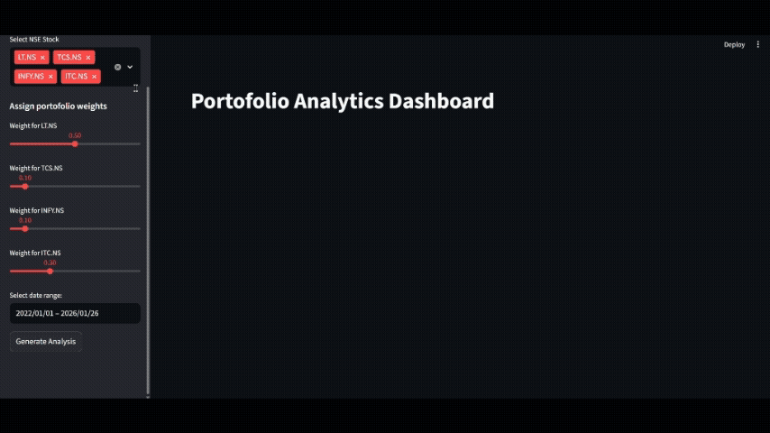
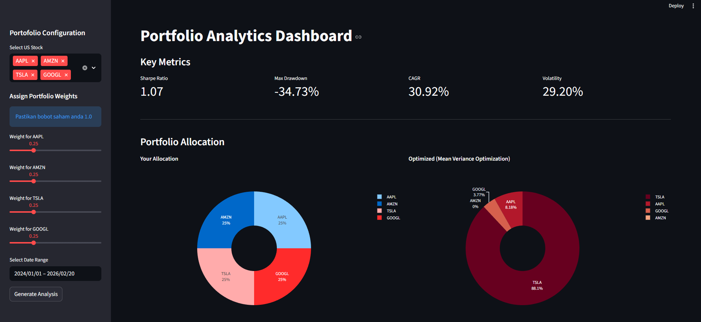

## Portfolio Analytics Dashboard

<!--  -->

Dashboard analitik yang mengintegrasikan **Modern Portfolio Theory (MPT)** untuk membantu investor mengoptimalkan alokasi aset dan mencari efisiensi maksimal dalam manajemen risiko.



Proyek ini menggunakan logika optimasi Mean-Variance untuk meminimalkan negatif dari Sharpe Ratio:

$$Sharpe Ratio = \frac{R_p - R_f}{\sigma_p}$$

Di mana $R_p$ adalah return portofolio dan $\sigma_p$ adalah standar deviasi (risiko). Dengan mencari titik tertinggi pada Efficient Frontier, kita mendapatkan alokasi aset yang paling optimal secara matematis.

### ✨ Fitur
---

* **Performance Metrics**: Analisis performa menggunakan library `QuantStats`, mencakup *Sharpe Ratio*, *Max Drawdown*, *CAGR*, dan *Volatility*.
* **Visual Comparison**: Visualisasi alokasi aset antara user portofolio dengan hasil optimasi MVO.
* **Normalization**: Fitur pada input bobot untuk selalu memastikan total alokasi aset selalu 100%.
* **HTML Report**: Dapat Mendownload secara langsung laporan performa p0rtofolio secara lengkap.


### 🛠️ Tools
---

* **Language**: Python 3.x
* **Framework**: Streamlit (Dashboard UI)
* **Data Source**: `yfinance`
* **Mathematics & Optimization**: `NumPy`, `SciPy` (SLSQP Method)
* **Analytics**: `QuantStats`
* **Visualization**: Plotly Express


### How to Run
---

1. **clone repository**

    ```bash
    git clone https://github.com/Yudi-Gnwn/stock-porto-analytics.git
    cd stock-porto-analytics
    ```

2. **create virtual environment**

    ```bash
    python -m venv venv
    # Windows
    venv\Scripts\activate
    # Mac/Linux
    source venv/bin/activate
    ```

3. **install dependencies**

    ```bash
    pip install -r requirements.txt
    ```

4. **run app**

    ```bash
    python -m streamlit run run.py
    ```

---

**Note:** *Projek ini dibuat untuk keperluan portofolio, keputusan investasi yang diambil adalah tanggung jawab individu.*